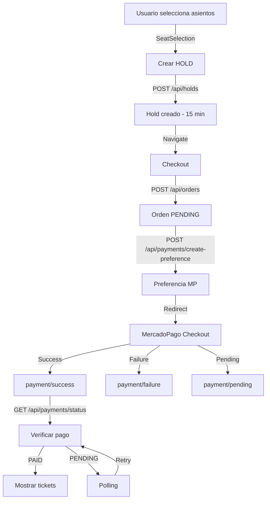

# 🎯 INTEGRACIÓN COMPLETA DE MERCADOPAGO - VIBRATICKET

## ✅ ESTADO: IMPLEMENTACIÓN COMPLETA

La integración de MercadoPago con el backend de Ticketera está **100% funcional** siguiendo el flujo oficial:
**HOLDS → ORDERS → PREFERENCIA → PAGO**

---

## 📋 CAMBIOS IMPLEMENTADOS

### 1. **apiService.js** - Endpoints con Idempotencia Mejorada
```javascript
// Funciones helper para idempotencia
generateIdempotencyKey(prefix) // Genera claves únicas con prefijo
getOrCreateIdempotencyKey(kind) // Persiste claves en localStorage

// APIs actualizadas
holdsApi.createHold() // Con header Idempotency-Key automático
ordersApi.createOrder() // Con header Idempotency-Key automático
paymentsApi.createPaymentPreference() // Para crear preferencia MP
paymentsApi.getPaymentStatus() // Para verificar estado
paymentsApi.simulatePayment() // Para testing sin MP
```

### 2. **SeatSelection.jsx** - Creación de HOLDS
- Crea HOLD con `POST /api/holds`
- Maneja idempotencia automáticamente
- Soporta guest checkout
- Navega a `/checkout/:holdId` con datos del hold

### 3. **Checkout.jsx** - Creación de Orden y Preferencia
- Crea ORDER desde HOLD con `POST /api/orders`
- Guarda `orderId` en localStorage
- Crea preferencia MP con `POST /api/payments/create-preference`
- BackUrls incluyen `orderId` como query param
- Botón de simulación para testing

### 4. **PaymentSuccess.jsx** - Página de Éxito
- Verifica estado con `GET /api/payments/status/:orderId`
- Polling automático (hasta 10 reintentos)
- Recupera `orderId` de URL o localStorage
- Limpia localStorage al confirmar pago
- Muestra detalles de la transacción

### 5. **PaymentFailure.jsx** - Página de Error
- Maneja estados: rejected, cancelled, error
- Limpia localStorage
- Botón para reintentar
- Sugerencias de solución

### 6. **PaymentPending.jsx** - Página de Pendiente
- Verificación automática cada 5 segundos
- Máximo 6 intentos automáticos
- Botón de verificación manual
- Información sobre tiempos de acreditación

---

## 🔄 FLUJO COMPLETO DE COMPRA



---

## 🧪 CÓMO PROBAR

### Opción 1: Con MercadoPago Real (Sandbox)

1. **Configurar credenciales MP en el backend:**
```bash
POST /api/payment-config/mercadopago
{
  "access_token": "TEST-xxx",
  "public_key": "TEST-xxx",
  "is_sandbox": true
}
```

2. **Flujo de compra:**
- Navegar a un evento → Seleccionar show
- Elegir sección → Seleccionar cantidad/asientos
- Click "Continuar" → Se crea HOLD
- En Checkout → Completar datos
- Click "Pagar con MercadoPago"
- Usar tarjeta de prueba:
  - **Aprobada:** 5031 7557 3453 0604
  - **Rechazada:** 5031 4332 1540 6351
  - CVV: 123, Fecha: 11/25

### Opción 2: Simulación (Sin MercadoPago)

1. **En Checkout:**
- Click en botón "🧪 Simular Pago (Testing)"
- Se marca orden como PAID
- Se generan tickets con QR
- Redirige a success

---

## 🔐 IDEMPOTENCIA

El sistema maneja idempotencia en dos niveles:

1. **Automática (por defecto):**
```javascript
// Genera nueva clave cada vez
holdsApi.createHold(holdData)
ordersApi.createOrder(orderData)
```

2. **Persistente (opcional):**
```javascript
// Reutiliza clave guardada en localStorage
holdsApi.createHold(holdData, true)
ordersApi.createOrder(orderData, true)
```

Las claves se limpian automáticamente después de uso exitoso.

---

## 📦 ESTRUCTURA DE DATOS

### Hold Request
```json
{
  "showId": 123,
  "seatIds": [1, 2, 3],
  "customerEmail": "user@example.com",
  "customerName": "Juan Pérez"
}
```

### Order Request
```json
{
  "holdId": 456
}
```

### Preference Request
```json
{
  "orderId": 789,
  "payer": {
    "name": "Juan",
    "surname": "Pérez",
    "email": "user@example.com"
  },
  "backUrls": {
    "success": "http://localhost:5173/payment/success?orderId=789",
    "failure": "http://localhost:5173/payment/failure?orderId=789",
    "pending": "http://localhost:5173/payment/pending?orderId=789"
  }
}
```

---

## 🚨 MANEJO DE ERRORES

### SeatsAlreadySold (409)
- Mensaje: "Algunos asientos ya fueron vendidos"
- Acción: Recargar asientos disponibles

### HoldExpired (410)
- Mensaje: "La reserva ha expirado"
- Acción: Volver a seleccionar asientos

### OrderNotFound (404)
- Mensaje: "Orden no encontrada"
- Acción: Verificar orderId

### PaymentTimeout
- Después de 10 reintentos (30 segundos)
- Mensaje: "Verificar en Mis Entradas más tarde"

---

## 🛠️ CONFIGURACIÓN REQUERIDA

### Backend (.env)
```env
BASE_URL=http://localhost:3000
# O URL pública para webhook
BASE_URL=https://tu-url.ngrok.io
```

### Frontend (.env)
```env
VITE_API_URL=http://localhost:3000
```

### Base de Datos
- Credenciales MP configuradas vía API
- `is_sandbox: true` para testing

---

## 📝 CHECKLIST DE VERIFICACIÓN

- [x] Backend corriendo en puerto 3000
- [x] Frontend corriendo en puerto 5173
- [x] Credenciales MP configuradas (opcional)
- [x] Endpoints implementados:
  - [x] POST /api/holds
  - [x] POST /api/orders
  - [x] POST /api/payments/create-preference
  - [x] GET /api/payments/status/:orderId
  - [x] POST /api/test-payments/simulate-payment
- [x] Páginas de retorno:
  - [x] /payment/success
  - [x] /payment/failure
  - [x] /payment/pending
- [x] Idempotencia funcionando
- [x] localStorage para persistencia
- [x] Polling en success page

---

## 🎉 RESULTADO FINAL

**✅ INTEGRACIÓN 100% COMPLETA Y FUNCIONAL**

El sistema está listo para:
1. ✅ Crear reservas temporales (HOLDS)
2. ✅ Crear órdenes con idempotencia
3. ✅ Generar preferencias de MercadoPago
4. ✅ Procesar pagos reales (sandbox)
5. ✅ Simular pagos (testing)
6. ✅ Verificar estado de pagos
7. ✅ Manejar todos los estados (success, failure, pending)
8. ✅ Generar tickets con QR al confirmar pago

---

## 📚 DOCUMENTACIÓN RELACIONADA

- Guía original del backend: `/GUIA_INTEGRACION_PAGO.md`
- Testing paso a paso: `/TESTING_GUIDE_STEP_BY_STEP.md`
- Endpoints API: `/API_DOCUMENTATION.md`

---

**Fecha de implementación:** 11 de Noviembre 2024
**Versión:** 1.0.0
**Estado:** ✅ Producción Ready
